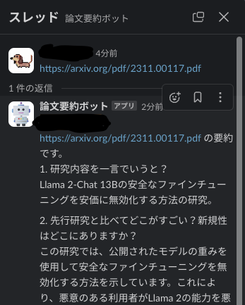

# paper_interpreter

論文を読み取り、[落合陽一形式のフォーマット](https://www.slideshare.net/Ochyai/1-ftma15#65)で要約を返してくれるSlackボット



## 実行方法
- Slack APIの設定を行う. 2023年11月現在の設定方法は以下.
  - 「App Home」のDisplay Nameと「Basic Information」のDisplay Informationを設定する
  - 「Basic Information」の「App-Level Tokens」から`connections:write`スコープのトークンを生成する
    - これを`.env`の`SLACK_APP_TOKEN`に格納する
  - 「Socket Mode」と「Event Subscriptions」の「Enable Events」をOnにし、「Subscribe to bot events」から`app.mention`と`message.im`を選択する
  - 「OAuth & Permissions」の「Scopes」から、`app_mentions:read`,`im:read`, `chat:write`を追加する
    - 追加後に「Bot User OAuth Token」が生成されるので、これを`.env`の`SLACK_BOT_TOKEN`に格納する
  - 「OAuth & Permissions」「Install Worksspace」からSlackにボットを追加する
- `.env`に環境変数を格納する
  - MODELは`GPT3`か`GPT4`を選択
```.env
OPEN_AI_API_KEY=
MODEL=GPT3
SLACK_BOT_TOKEN=
SLACK_APP_TOKEN=
```
- `docker compose up`でボットを起動する

## 注意事項
論文全文を読み取り、トークン数の多いChatGPTモデルに入力しています.

利用料金には十分気を付けてください.
